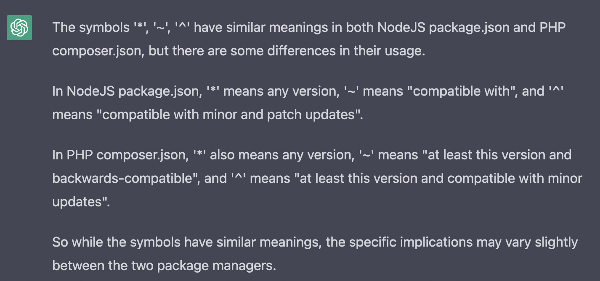
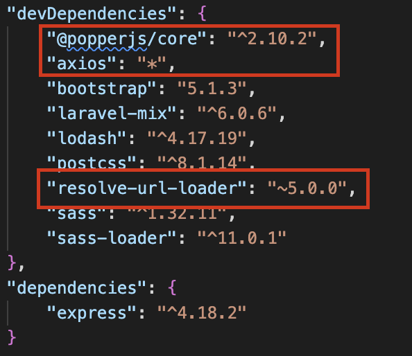
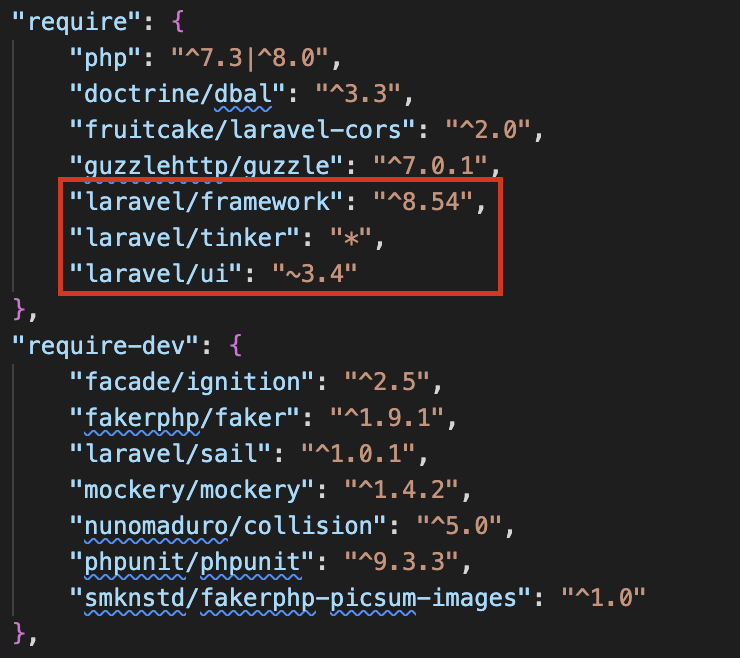

# Check package auto update version
- A GitHub action to automatically check if Node.js and PHP packages are up to date.
- The package will automatically update to a newer version that include "*", "~", "^" symbols in package.json for NodeJS or composer.json for PHP in this version.




# Usage

1. Copy file `check-version.yml` in directory `.github/workflows` to your project
```sh
cp ./.github/workflows/check-version.yml $YOUR_PROJECT/.github/workflows/check-version.yml
```
2. Copy folder `scripts2` to your project
```sh
cp -r ./scripts2 $YOUR_PROJECT/scripts2
```

# Note
- If you want the Github action to throw the checking fail and break the checking process, please uncomment lines 33-35 in directory `./scripts2/node.sh` and lines 12-14 in directory `./scripts/laravel.sh`
